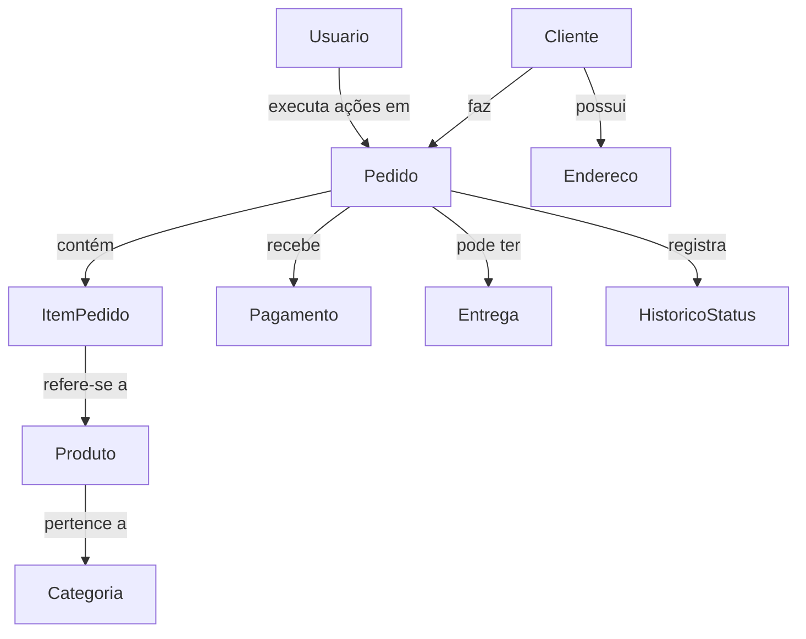
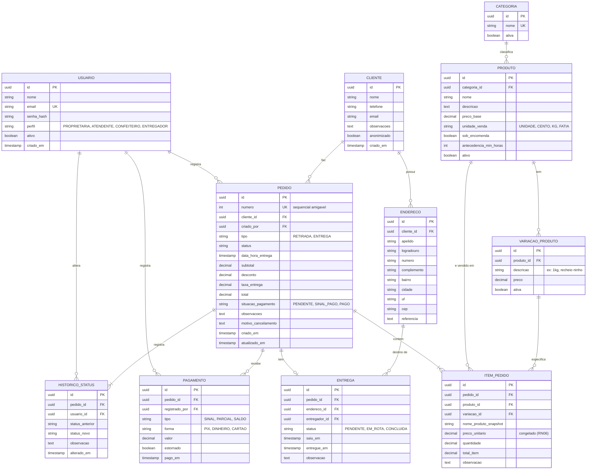
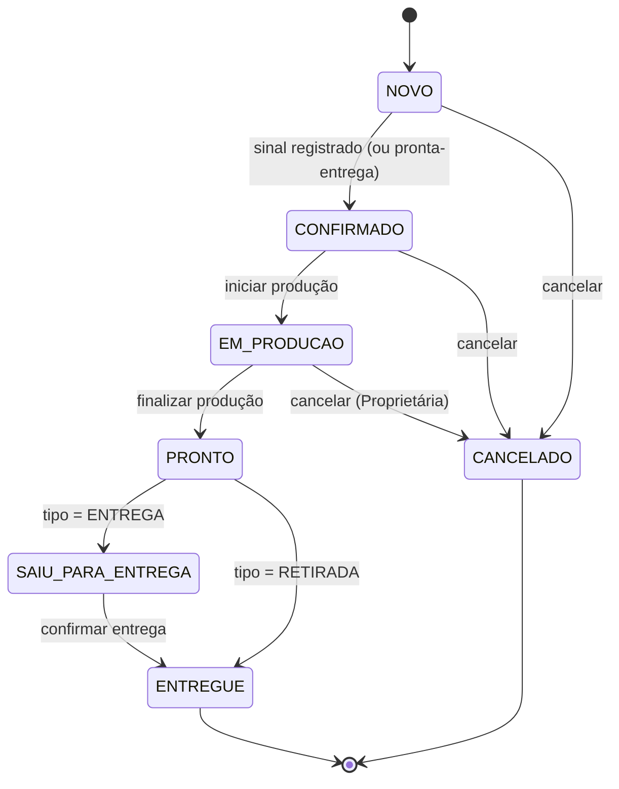
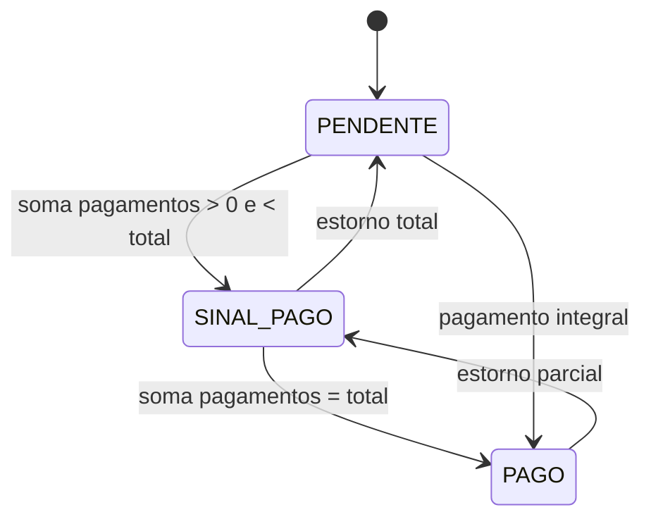
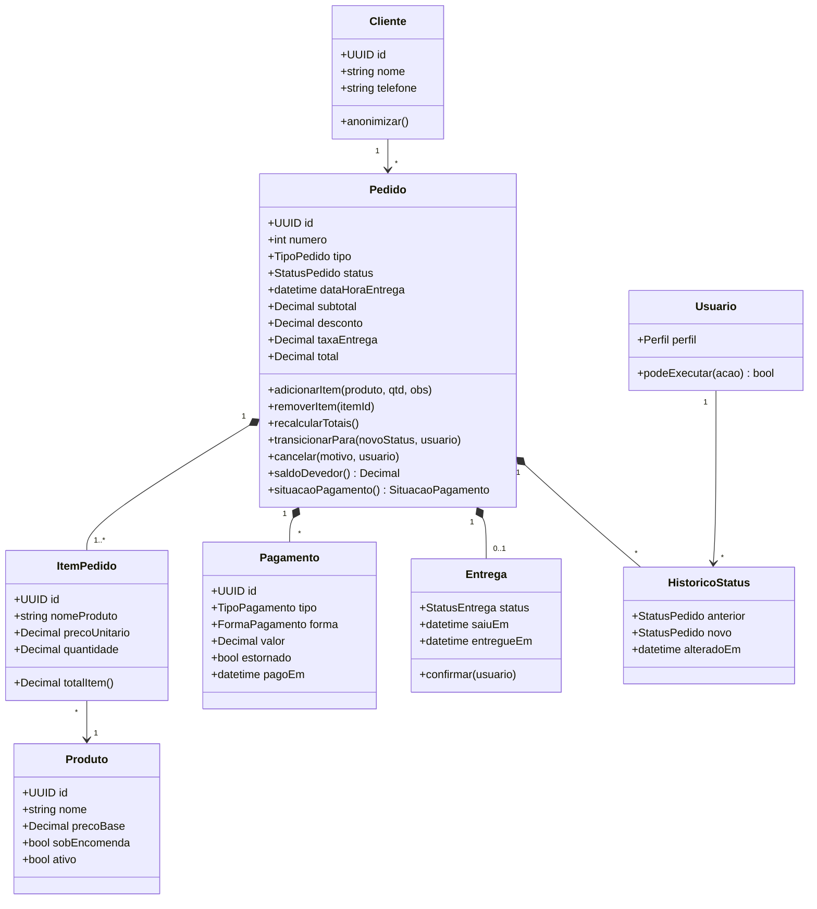
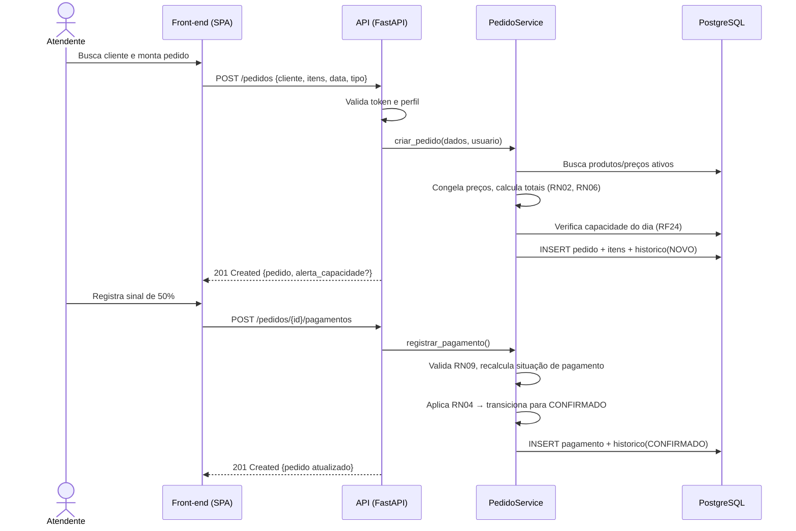
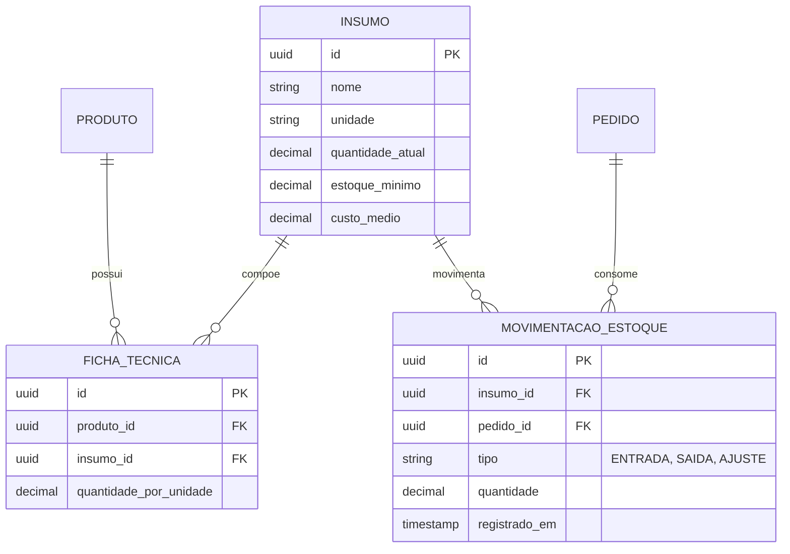

# Sistema de Controle de Pedidos — Doceria da Marta

## 02 · Modelagem do Sistema


## 1. Modelo conceitual do domínio

O domínio gira em torno do **Pedido**. Um cliente faz pedidos; cada pedido tem itens (produtos), pagamentos, uma possível entrega e um histórico de status.



---

## 2. Modelo Entidade-Relacionamento (ER)




## 3. Máquina de estados do Pedido



**Quem pode fazer cada transição:**

| Transição | Perfis autorizados |
|---|---|
| `NOVO → CONFIRMADO` | Atendente, Proprietária |
| `CONFIRMADO → EM_PRODUCAO` | Confeiteiro, Proprietária |
| `EM_PRODUCAO → PRONTO` | Confeiteiro, Proprietária |
| `PRONTO → SAIU_PARA_ENTREGA` | Entregador, Proprietária |
| `→ ENTREGUE` | Entregador (entrega), Atendente (retirada), Proprietária |
| `→ CANCELADO` | Atendente (até `CONFIRMADO`), Proprietária (qualquer estado ≠ `ENTREGUE`) |

### 3.1 Máquina de estados do pagamento (derivada)



---

## 4. Diagrama de classes (domínio)




## 5. Diagramas de sequência

### 5.1 Registrar pedido com sinal



### 5.2 Entrega e quitação do saldo

```mermaid
sequenceDiagram
    actor En as Entregador
    participant UI as Front-end
    participant API as API
    participant S as PedidoService
    participant DB as PostgreSQL

    En->>UI: Abre "Entregas do dia"
    UI->>API: GET /entregas?data=hoje
    API-->>UI: Lista (endereço, contato, saldo)
    En->>UI: Recebe o saldo e confirma
    UI->>API: POST /pedidos/{id}/pagamentos {SALDO}
    UI->>API: POST /pedidos/{id}/transicoes {ENTREGUE}
    API->>S: transicionar(ENTREGUE)
    S->>S: Valida RN08 (saldo = 0 ou autorização)
    S->>DB: UPDATE pedido, entrega; INSERT historico
    API-->>UI: 200 OK
```

---

## 6. Modelo de permissões (RBAC)

| Recurso / Ação | Proprietária | Atendente | Confeiteiro | Entregador |
|---|:-:|:-:|:-:|:-:|
| Gerenciar usuários | ✅ | ❌ | ❌ | ❌ |
| Gerenciar catálogo/preços | ✅ | ❌ | ❌ | ❌ |
| Gerenciar clientes | ✅ | ✅ | ❌ | ❌ |
| Criar/editar pedido | ✅ | ✅ | ❌ | ❌ |
| Aplicar desconto | ✅ | ❌ | ❌ | ❌ |
| Registrar pagamento | ✅ | ✅ | ❌ | ✅ (saldo na entrega) |
| Ver fila de produção | ✅ | ✅ | ✅ | ❌ |
| Atualizar produção | ✅ | ❌ | ✅ | ❌ |
| Ver/confirmar entregas | ✅ | ✅ (ver) | ❌ | ✅ |
| Cancelar pedido | ✅ | ✅ (até CONFIRMADO) | ❌ | ❌ |
| Relatórios financeiros | ✅ | ❌ | ❌ | ❌ |

---

## 7. Extensão futura (v2): estoque e ficha técnica



Com isso será possível calcular **custo e margem por produto** e gerar **lista de compras** a partir da produção planejada.