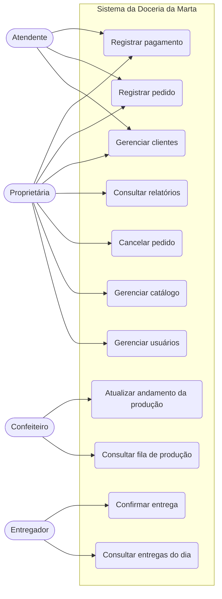

# Sistema de Controle de Pedidos — Doceria da Marta

## 01 · Levantamento e Especificação de Requisitos

> **Versão:** 0.1 (rascunho inicial) · **Status:** para validação com a Marta
> Este documento parte de **premissas** (seção 2) que devem ser confirmadas com o cliente antes de seguir para a implementação.

---

## 1. Visão geral

### 1.1 Problema
A doceria recebe pedidos por canais informais (WhatsApp, Instagram, telefone, balcão). Sem um controle central, surgem problemas típicos: pedidos esquecidos, datas de entrega conflitantes, dúvida sobre o que já foi pago, excesso de produção em um dia e ociosidade em outro, e nenhuma visão de faturamento.

### 1.2 Objetivo
Centralizar o ciclo de vida dos pedidos — do registro à entrega e ao pagamento — dando à Marta visibilidade da produção, do dinheiro a receber e do histórico de clientes.

### 1.3 Escopo

| Dentro do escopo (MVP) | Fora do escopo (versões futuras) |
|---|---|
| Cadastro de clientes e produtos | Loja online / portal de autoatendimento do cliente |
| Registro e acompanhamento de pedidos e encomendas | Integração automática com WhatsApp (bot) |
| Controle de pagamentos (sinal e saldo) | Emissão de nota fiscal |
| Agenda de produção e entregas | Integração com gateways de pagamento (Pix automático, cartão) |
| Relatórios básicos (vendas, a receber) | Controle completo de estoque e ficha técnica (v2) |
| Autenticação e perfis de acesso | Aplicativo mobile nativo |

### 1.4 Partes interessadas (atores)

| Ator | Descrição |
|---|---|
| **Proprietária (Marta)** | Administra tudo: cardápio, preços, usuários, relatórios. |
| **Atendente** | Registra pedidos, atende clientes, registra pagamentos. |
| **Confeiteiro(a)** | Consulta a fila de produção e atualiza o andamento. |
| **Entregador(a)** | Consulta entregas do dia e confirma a entrega. |
| **Cliente** | Não acessa o sistema no MVP; é uma entidade cadastrada. |

---

## 2. Premissas e perguntas em aberto

**Premissas adotadas (assumidas até prova em contrário):**

1. A doceria vende produtos de **pronta-entrega** (ex.: brigadeiro, fatia de torta) e **encomendas** com data futura (bolos, kits de festa, docinhos por cento).
2. Encomendas exigem **sinal** (entrada) para confirmar; o restante é pago na entrega/retirada.
3. Há **retirada no balcão** e **entrega** em endereço, com taxa de entrega por pedido.
4. O sistema será usado por **1 a 5 pessoas**, em computador ou celular (web responsiva).
5. O volume é pequeno/médio: algumas dezenas de pedidos por dia no máximo.
6. Idioma e moeda: português (Brasil), BRL.

**Perguntas para validar com a Marta:**

- [ ] Os produtos têm variações (tamanho, sabor de recheio, camadas)? Como o preço varia?
- [ ] Existe um limite diário de produção (capacidade)? Há prazo mínimo de antecedência para encomendas?
- [ ] Qual o percentual do sinal? É sempre o mesmo?
- [ ] Quais formas de pagamento aceita (Pix, dinheiro, cartão, fiado)?
- [ ] A taxa de entrega é fixa, por bairro ou por distância?
- [ ] Quer controlar estoque de insumos já no início?
- [ ] Precisa imprimir comanda/ordem de produção?
- [ ] Há necessidade de LGPD formal (guarda de dados de clientes)? *(Recomendado tratar desde o MVP.)*

---

## 3. Requisitos funcionais

**Prioridade (MoSCoW):** **M** = Deve ter (MVP) · **S** = Deveria ter · **C** = Poderia ter · **W** = Não agora

### 3.1 Autenticação e usuários

| ID | Requisito | Prior. |
|---|---|---|
| RF01 | O sistema deve permitir login com e-mail e senha. | M |
| RF02 | O sistema deve controlar acesso por perfil (Proprietária, Atendente, Confeiteiro, Entregador). | M |
| RF03 | A proprietária deve poder criar, editar e desativar usuários. | M |
| RF04 | O usuário deve poder alterar a própria senha. | S |

### 3.2 Clientes

| ID | Requisito | Prior. |
|---|---|---|
| RF05 | Cadastrar cliente com nome, telefone/WhatsApp, e-mail (opcional) e observações. | M |
| RF06 | Cadastrar um ou mais endereços por cliente. | M |
| RF07 | Buscar clientes por nome ou telefone. | M |
| RF08 | Consultar o histórico de pedidos de um cliente. | S |
| RF09 | Anonimizar/excluir dados do cliente mediante solicitação (LGPD). | S |

### 3.3 Catálogo de produtos

| ID | Requisito | Prior. |
|---|---|---|
| RF10 | Cadastrar, editar e inativar produtos com nome, descrição, categoria, preço e unidade de venda (unidade, cento, kg, fatia). | M |
| RF11 | Organizar produtos em categorias (bolos, docinhos, tortas, kits…). | M |
| RF12 | Definir se o produto é **pronta-entrega** ou **sob encomenda** e o prazo mínimo de antecedência. | S |
| RF13 | Permitir variações de produto (tamanho/sabor) com preço próprio. | S |
| RF14 | Registrar foto do produto. | C |

### 3.4 Pedidos

| ID | Requisito | Prior. |
|---|---|---|
| RF15 | Criar pedido associando um cliente e um ou mais itens (produto, quantidade, observação). | M |
| RF16 | Informar **data/hora de entrega ou retirada** e o tipo (retirada ou entrega). | M |
| RF17 | Calcular automaticamente subtotal, taxa de entrega, desconto e total. | M |
| RF18 | Aplicar desconto em valor ou percentual (restrito a perfis autorizados). | S |
| RF19 | Registrar observações do pedido (ex.: tema do bolo, texto na cobertura, alergias). | M |
| RF20 | Editar pedido enquanto o status permitir (regras em RN05). | M |
| RF21 | Cancelar pedido registrando o motivo. | M |
| RF22 | Alterar o status do pedido seguindo o fluxo definido (RN03) e manter **histórico** de mudanças. | M |
| RF23 | Listar e filtrar pedidos por status, data de entrega, cliente e pagamento. | M |
| RF24 | Alertar conflito quando a capacidade diária de produção for excedida. | S |
| RF25 | Imprimir/exportar comanda do pedido (PDF). | S |
| RF26 | Gerar mensagem de confirmação pronta para enviar por WhatsApp (texto copiável/link `wa.me`). | C |

### 3.5 Pagamentos

| ID | Requisito | Prior. |
|---|---|---|
| RF27 | Registrar pagamentos (sinal, parcial, saldo) com forma, valor e data. | M |
| RF28 | Exibir situação financeira do pedido: **Pendente**, **Sinal pago**, **Pago**. | M |
| RF29 | Listar pedidos com saldo a receber. | M |
| RF30 | Estornar/corrigir um pagamento registrado por engano, com trilha de auditoria. | S |

### 3.6 Produção

| ID | Requisito | Prior. |
|---|---|---|
| RF31 | Exibir a **fila de produção** agrupada por data de entrega. | M |
| RF32 | Exibir o **consolidado de produção do dia** (ex.: "120 brigadeiros, 3 bolos de chocolate"). | S |
| RF33 | Permitir ao confeiteiro marcar o pedido como "Em produção" e "Pronto". | M |

### 3.7 Entregas

| ID | Requisito | Prior. |
|---|---|---|
| RF34 | Listar as entregas do dia com endereço, cliente, contato e saldo a cobrar. | M |
| RF35 | Entregador confirmar entrega (com data/hora e observação). | M |
| RF36 | Registrar o recebimento do saldo no momento da entrega. | S |

### 3.8 Relatórios e painel

| ID | Requisito | Prior. |
|---|---|---|
| RF37 | Painel inicial com pedidos do dia, atrasados e a receber. | M |
| RF38 | Relatório de vendas por período (total, por produto, por categoria). | S |
| RF39 | Relatório de produtos mais vendidos e clientes mais frequentes. | C |
| RF40 | Exportar relatórios em CSV. | C |

### 3.9 Estoque de insumos *(planejado para a v2)*

| ID | Requisito | Prior. |
|---|---|---|
| RF41 | Cadastrar insumos e quantidades em estoque. | W |
| RF42 | Cadastrar ficha técnica (receita) por produto. | W |
| RF43 | Baixar estoque automaticamente ao produzir pedido. | W |
| RF44 | Alertar estoque mínimo e gerar lista de compras. | W |

---

## 4. Regras de negócio

| ID | Regra |
|---|---|
| RN01 | Todo pedido possui exatamente um cliente, ao menos um item e uma data/hora de entrega/retirada futura no momento da criação. |
| RN02 | Total do pedido = Σ(preço unitário × quantidade) + taxa de entrega − desconto. O total nunca pode ser negativo. |
| RN03 | **Fluxo de status:** `NOVO → CONFIRMADO → EM_PRODUCAO → PRONTO → (SAIU_PARA_ENTREGA) → ENTREGUE`. `CANCELADO` é possível a partir de qualquer estado exceto `ENTREGUE`. Transições fora do fluxo são proibidas. |
| RN04 | Pedido sob encomenda só vai a `CONFIRMADO` após o registro do sinal (percentual configurável, padrão sugerido: 50%). Pronta-entrega pode ser confirmada sem sinal. |
| RN05 | Itens e data só podem ser editados em `NOVO` e `CONFIRMADO`. Após `EM_PRODUCAO`, só observações podem ser alteradas, e apenas pela Proprietária. |
| RN06 | O preço do item é **copiado** para o pedido no momento da venda; alterar o preço do produto depois não altera pedidos existentes. |
| RN07 | `SAIU_PARA_ENTREGA` só se aplica a pedidos do tipo entrega; retirada vai de `PRONTO` direto a `ENTREGUE`. |
| RN08 | Um pedido só pode ser marcado como `ENTREGUE` se o saldo estiver quitado **ou** a Proprietária autorizar explicitamente (fiado). |
| RN09 | Soma dos pagamentos não pode exceder o total do pedido (excedente deve ser tratado como troco/estorno). |
| RN10 | Cancelamento exige motivo. Se houve sinal pago, o sistema pede a decisão: reter ou devolver (política da doceria). |
| RN11 | Produtos inativos não aparecem para novos pedidos, mas permanecem nos pedidos antigos. |
| RN12 | Todas as mudanças de status e pagamentos registram **quem** fez e **quando**. |

---

## 5. Requisitos não funcionais

| ID | Categoria | Requisito |
|---|---|---|
| RNF01 | Usabilidade | Interface em português, responsiva, utilizável em celular (atendimento rápido durante a produção). |
| RNF02 | Usabilidade | Registrar um pedido típico em até ~2 minutos por uma pessoa treinada. |
| RNF03 | Desempenho | Respostas das telas principais em até 2 s para até 10 usuários simultâneos. |
| RNF04 | Segurança | Senhas armazenadas com hash forte (bcrypt/argon2); comunicação via HTTPS. |
| RNF05 | Segurança | Autorização por perfil em todas as rotas do back-end (nunca só no front). |
| RNF06 | Privacidade | Conformidade com a LGPD: coleta mínima, finalidade clara, possibilidade de exclusão/anonimização. |
| RNF07 | Disponibilidade | Meta de 99% no horário comercial; indisponibilidades planejadas fora do horário. |
| RNF08 | Confiabilidade | Backup automático diário do banco, com retenção mínima de 14 dias e teste periódico de restauração. |
| RNF09 | Auditoria | Mudanças de status, pagamentos e cancelamentos devem ser rastreáveis. |
| RNF10 | Manutenibilidade | Código modular, tipado, com cobertura de testes ≥ 70% nas regras de negócio. |
| RNF11 | Portabilidade | Execução em contêineres (Docker), sem dependência de provedor específico. |
| RNF12 | Compatibilidade | Navegadores modernos (Chrome, Edge, Firefox, Safari) das 2 últimas versões principais. |
| RNF13 | Observabilidade | Logs estruturados e endpoint de saúde (`/health`). |

---

## 6. Casos de uso (visão geral)

### 6.1 Caso de uso detalhado — UC04 Registrar pedido

| Item | Descrição |
|---|---|
| **Ator principal** | Atendente (ou Proprietária) |
| **Pré-condições** | Usuário autenticado; produtos ativos cadastrados. |
| **Gatilho** | Cliente solicita um pedido/encomenda. |
| **Fluxo principal** | 1. Busca o cliente (ou cadastra novo).  2. Define tipo (retirada/entrega) e data/hora.  3. Adiciona itens com quantidade e observações.  4. Sistema calcula o total (RN02).  5. Informa endereço (se entrega) e taxa.  6. Salva o pedido com status `NOVO`.  7. Opcionalmente registra o sinal; sistema muda para `CONFIRMADO`. |
| **Fluxos alternativos** | 2a. Data com capacidade excedida → sistema alerta e permite prosseguir (Proprietária) ou escolher outra data.  3a. Produto inativo → não é listado.  7a. Encomenda sem sinal → permanece `NOVO`. |
| **Pós-condições** | Pedido persistido com histórico de status inicial e itens com preço congelado (RN06). |
| **Requisitos relacionados** | RF15–RF19, RF24, RF27, RN01–RN04, RN06 |

### 6.2 Histórias de usuário (exemplos)

- **Como** atendente, **quero** buscar o cliente pelo telefone **para** registrar o pedido sem redigitar seus dados.
- **Como** Marta, **quero** ver todas as encomendas da semana por dia **para** planejar a produção e evitar sobrecarga.
- **Como** confeiteiro, **quero** ver o consolidado do dia **para** saber quantas unidades de cada doce preparar.
- **Como** entregador, **quero** ver o endereço e o saldo a cobrar **para** concluir a entrega sem ligar para a loja.
- **Como** Marta, **quero** saber quanto ainda tenho a receber **para** controlar meu caixa.

---

## 7. Critérios de aceite do MVP

1. Marta consegue cadastrar o cardápio completo e os preços sem ajuda técnica.
2. Um pedido de encomenda passa por todo o fluxo (`NOVO` → `ENTREGUE`) com sinal e saldo registrados.
3. O consolidado de produção do dia bate com os pedidos confirmados.
4. Nenhum usuário acessa funções fora do seu perfil.
5. O backup diário está ativo e uma restauração de teste foi realizada.

---

## 8. Matriz de rastreabilidade (resumo)

| Objetivo | Requisitos | Entidades (ver `02-modelagem.md`) |
|---|---|---|
| Não perder pedidos | RF15–RF23 | `pedido`, `item_pedido`, `historico_status` |
| Saber o que já foi pago | RF27–RF30 | `pagamento` |
| Planejar produção | RF24, RF31–RF33 | `pedido`, `item_pedido`, `produto` |
| Entregar corretamente | RF34–RF36 | `entrega`, `endereco` |
| Enxergar o negócio | RF37–RF40 | Consultas sobre todas as entidades |